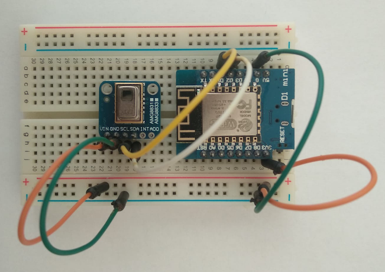

# GridEye

This is sketch example for GridEye sensor that works with the Home Assistant integration.

# Libraries

1. [AMG8833](https://github.com/adafruit/Adafruit_AMG88xx)
2. [RemoteDebug](https://github.com/JoaoLopesF/RemoteDebug)
3. [ESP8266WebServer](https://github.com/esp8266/Arduino/tree/master/libraries/ESP8266WebServer)
4. [Jled](https://github.com/jandelgado/jled)